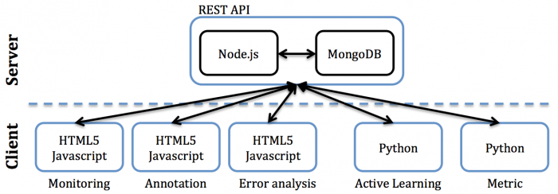
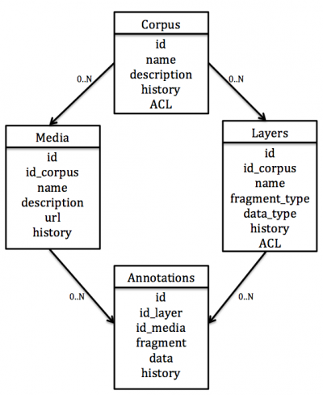

# The CAMOMILE collaborative annotation platform

### Johann Poignant1, Mateusz Budnik2, Hervé Bredin1, Claude Barras1, Mickael Stefas3, Pierrick Bruneau3,  Gilles Adda1,6, Laurent Besacier2,  Hazim Ekenel4, Gil Francopoulo6, Javier Hernando5, Joseph Mariani1,6, Ramon Morros5, Georges Quénot2, Thomas Tamisier3

1. LIMSI, CNRS, Univ. Paris-Sud, Université Paris-Saclay, F-91405 Orsay
2. LIG, Univ. Grenoble Alpes, Grenoble, France
3. LIST, Esch-sur-Alzette, Luxembourg 
4. ITÜ, Istanbul, Turkey
5. UPC, Barcelona, Spain
6. IMMI-CNRS, Orsay, France

## Introduction

Human activity is generating growing volumes of heterogeneous data, available in particular via the Web. Multimodal, multimedia, multilingual (3M) data can be collected and explored to gain new insights in social sciences, linguistics, economics, behavioural studies as well as artificial intelligence and computer sciences. But to be analyzed through statistical-based machine learning methods, these data should be available in very large amounts and annotated. Annotating data is costly as it involves manual work, and in this regard 3M data, for which we need to annotate different modalities with different levels of abstraction is especially costly.

Current annotation frameworks often involve a local manual annotation [1-4] sometimes supported by automatic processings [5]. In this case, dealing with multiple annotators and different versions of the annotation files quickly becomes infeasible. 
Browser-based annotations interfaces, linked to a server for storing the annotations, can provide a solution to this problem, all the more so as browser performance and multimedia support dramatically improved in the recent years; this is a direction taken by LDC with its WebAnn initiative.

In the context of the CHIST-ERA CAMOMILE project (Collaborative Annotation of multi-MOdal, multI-Lingual and multi-mEdia documents), we developed a collaborative annotation framework for 3M data.
We focused our work on the annotation of people, which are usually the centre of attention in 3M documents, and chose a use-case driven approach with different scenarios: collaborative annotation where several human annotators simultaneously label either the same or a different layer of a document, the monitoring and coordination of the annotation workflow, or active learning applications, where an automatic person recognition systems is used to bootstrap a manual annotation and is retrained or adapted using this result. Developers of mono-modal person identification components are also interested in the error analysis of automatic annotation systems, and need an interface that allows an easy visualization of errors and navigation between the reference annotation and the hypothesized outputs.

In this paper, we first describe the organization and the implementation of the framework server. Given the versatile nature of the analysis which can be performed on 3M data, the structure of the server was kept intentionnaly simple in order to preserve its genericity. Interfaces tailored specifically to the needed task can then be developed in an agile way, relying on simple but reliable services for the management of the centralized annotations. We present our implementation of an active learning scenario for person annotation in video, relying on the CAMOMILE server. 

## Collaborative annotation server

Aiming for a flexible development and use, the collaborative annotation framework is implemented using state of the art web-based technologies, namely libraries and tools developed mostly in Javascript and Python. The ultimate purpose of the platform is to provide on demand overviews and details regarding the 3M data, and the associated automatic and manual annotations. Some views would be dedicated to the fine-grain inspection of annotation files, while some others would serve some higher-level task, such as summarizing the media of a specific corpus according to the exhaustiveness of their associated annotations, or the performance of the algorithms to infer the latter. Multiple users may be involved, synchronously or asynchronously, and with several roles (manual annotators, recognition algorithm developer, adjudicator). Web-based technologies and Javascript already comprise many building blocks suitable for supporting this kind of collaborative behavior. As illustrated in Figure 1, the proposed collaborative annotation framework follows a client/server architecture. This paradigm facilitates the work of multiple users on consistent data sources, as required by the project specifics. The involved server-side technologies rely solely on exchanges via the HTTP protocol, facilitating the design of interoperable software components. The server focuses essentially on data and authentication management tasks, leaving the application logic to the client side. The aim of doing so is to design a general and consistent service, allowing the agile development of browser-based clients, each implemented according to a concrete use-case (e.g., annotation, error analysis…).

**Figure 1: CAMOMILE client-server platform**

There are two main reasons that made us implement client/server interfaces using REST services. First, in the REST architecture style, clients and servers exchange representations of resources using a standardized interface and protocol. These principles encourage RESTful applications to be simple, lightweight, and have high performance. Second, RESTful web services typically map the four main HTTP methods to perform predefined operations: GET, PUT, DELETE, and POST. These operations can fulfill the needs of annotating 3M data, such as create, read, update or delete annotations.
Resources are the fundamental concept in any RESTful API, and thus they need to be specified (as collections, tables, relationships between them) before designing REST API services. In our framework, resources are annotations, which are represented in JSON formats, stored in a MongoDB database. Based on the use cases designed in the CAMOMILE project, we specify the following collections (i.e. tables in traditional database systems) for our application: corpus, media, layers, annotations. The corpus collection describes all available corpora. Each corpus contains a set of media and a set of layer. A medium corresponds to a multimedia resource (e.g., a video or audio file). A layer is composed of multiple annotations with the same type (e.g. one layer for manual annotations of speech turns or one layer for annotations of face tracks). An annotation is uniquely defined by a media fragment (e.g., a temporal segment) and attached data (e.g. the name of the current speaker).

**Figure 2: CAMOMILE server data model**

Figure 2 illustrates an entity-relationship diagram of these collections (tables), where: *id* is the identifier of a resource; *id_xxx* is the identifier of the resource *xxx*; *name* provides a short description of a resource (corpus, media, layer, user, group or queue). *fragment_type* is a generic type and describes the type of the fragments, which are annotation units stored in the annotation collection. *fragment_type* can currently be segments or rectangles (for face recognition). *data_type* is the data type of each annotated fragment, and it can be a person name or a spoken word. The range of supported types is designed to be easily extended to potentially new annotation tasks. History is a list of modifiers and each medium can be accessed via an url. ACL correspond to the user or group rights (read, write, admin) on the resource; the media inherits the rights of the corpus to which it belongs, the annotations inherits the rights of the layers to which it belongs. Group and user are defined by a unique name and a description, a group contains a list of users and the user role can be a simple "user" or "admin" of the server. Finally, a last table is dedicated to queues which correspond to a list of elements. Queues have also a management of users and groups rights.

A documentation with all the routes available on this server can be found at 
[http://camomile-project.github.io/camomile-server](http://camomile-project.github.io/camomile-server); the source code of the camomile server is distributed under MIT open source license at
[https://github.com/camomile-project/camomile-server](https://github.com/camomile-project/camomile-server) and is also provided in a Docker image allowing an easy installation.
Along with the server, Python and JavaScript clients embedding the REST API into native language objects have also been developed and are distributed in sibling repositories.

## Active learning use case

An interface has been designed for person annotation in videos using the proposed platform. This above framework can be easily extended with additional functionality to make the annotation process more efficient. To that end, an active learning use case is presented, which can be useful when the full annotation of the whole dataset is impossible due to cost or time constraints. Active learning is a set of algorithms that help with selecting  potentially informative samples for human annotation, while trying to avoid those that are redundant.

In this scenario, the active learning (AL) system is based on the propagation of labels with the use of hierarchical clustering. Ideally, each cluster should correspond to a single person. Normally, the goal is to give a label (be it manually or automatically) to every segment in the dataset and purest clusters as possible.

Automatically generated segments of a multimedia resource are used as queries. These segments are initially clustered using a distance measure dependent on the media (e.g. distance between HOG descriptors for face segments).  Afterwards, a cluster is selected for annotation based on a specific criterion (e.g. size of the cluster or how dense and well separated it is) depending on the annotation scenario. Next, a representative segment from the selected cluster is presented for the user to label. Initially, it is the one closest to the centroid of a cluster, i.e. having the minimal distance to all other segments within it. Once a cluster contains at least one annotated segment, outliers are selected, which are most likely to contain information belonging to a different person.

After a segment is annotated by the user the cluster structure is modified accordingly. For example, two clusters that contain segments with the same name are merged. On the other hand, a cluster which contains segments with different labels is divided. A label assigned to a segment within a cluster is propagated to all of its unlabeled members. 

**Figure 3: Active learning system**

The AL system is connected to the collaborative annotation framework via the use of two different types of queues. The interaction between these two systems is shown in Figure 3. An input queue is filled with annotations, i.e. media fragments (see Figure 2), which are suggested by the AL algorithm for annotation. The task for the human annotator can be either identification, if the data field is empty (no name given to the fragment), or verification when a label is already assigned to the media fragment. The latter case can be used to verify the quality of automatically propagated labels or previous annotations done by humans. The most recent label given to a fragment is stored in the data field, while all the previous ones are added to the history list. This mechanism can be used for data cleaning and conflict resolution. From the input queue the annotations are distributed among the human annotators. Once a media fragment is assigned to a user, it is removed from the queue. 

The annotations processed by the users are pushed to the output queue. Because the media fragments are automatically generated, some may be noisy or may not contain any information related to the task (speech segments with only music or silence for example). They can be skipped by the user and will be stored separately and not be used by the AL system. The named annotations are removed from the output queue and used in the next step of the system. 

## Conclusions

The purpose of the CAMOMILE project has been to explore new practices around collaborative annotation and test it on specific use cases with dedicated prototypes. The developed framework can be summerized as a remote repository of annotations which are metadata attached to fragments of the media from a corpus, along with the associated RESTful API. It is thus compatible with other abstraction layers, e.g., annotation graphs [6], and the metadata can follow standards in the domain as proposed in the META-SHARE initiative [7]. This simple framework was robust enough to support the active learning scenario described in this paper, as long as the organization of a MediaEval task with 20 annotators involved [8]. Further developments would improve the platform, like a direct communication between the clients through WebSockets or a flexible historization of the annotations.
        
## Acknowledgements

We thank the members of the CAMOMILE international advisory committee for their time and their precious advices and proposals. This work was done in the context of the CHIST-ERA CAMOMILE project funded by the ANR (Agence Nationale de la Recherche, France), the FNR (Fonds National de La Recherche, Luxembourg), Tübitak (scientific and technological research council of Turkey) and Mineco (Ministerio de Economía y Competitividad, Spain)

## References

[1] K. Maeda & S. Strassel. Annotation Tools for Large-Scale Corpus Development: Using AGTK at the Linguistic Data Consortium. LREC 2004.  
[2] M. Kipp (2001) Anvil - A Generic Annotation Tool for Multimodal Dialogue. Proceedings of the 7th European Conference on Speech Communication and Technology (Eurospeech), pp. 1367-1370.  
[3] O. Aubert, Y. Prié (2007) Advene: an open-source framework for integrating and visualising audiovisual metadata. Open Source Competition: Technical presentation and overview paper. Proc. of ACM Multimedia Conference, Augsburg, sept. 2007  
[4] D. Mihalcik, ViPER Toolkit Home Page. http://viper-toolkit/sourceforge.net/  
[5] E. Auer, A. Russel, H. Sloetjes, P. Wittenburg, O. Schreer, S. Masnieri, D. Schneider, S. Tshöpel. ELAN as Flexible Annotation Framework for Sound and Image Processing Detectors, LREC 2010.  
[6] S. Bird and M. Liberman, “A Formal Framework for Linguistic Annotation,” Speech Communication, vol. 33, no. 1–2, pp. 23–60, Jan. 2001.  
[7] META-SHARE, <http://www.meta-net.eu/meta-share>  
[8] J. Poignant et al. Submitted to LREC 2016.

