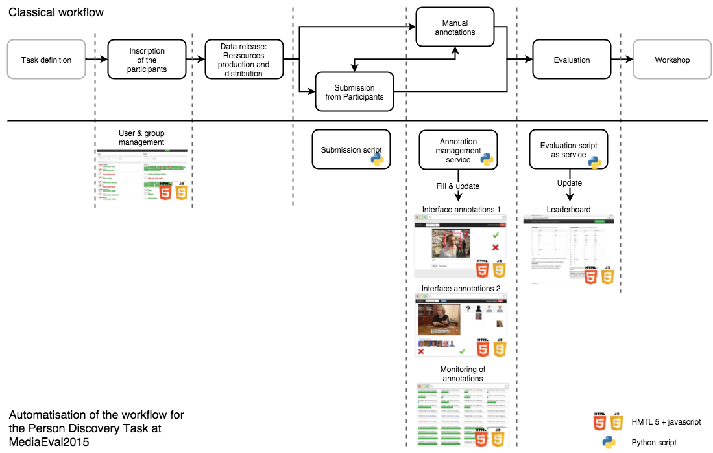

# Workflow management for a multimodal technology evaluation involving collaborative annotation

### Johann Poignant, Hervé Bredin, Claude Barras, Mickael Stefas, Pierrick Bruneau, Thomas Tamisier

## Introduction

Evaluation has been a driving force for research in the field of human language technology for decades, thanks to the efforts of NIST [1] followed by the CLEF initiative or campaigns like ESTER and ETAPE. The concept has been successfully transposed to the image processing and more generally to the multimedia communities with the CLEAR, TRECVID, REPERE or MediaEval campaigns, to cite a few significant ones. More generally, it is fitted to the assessment of experimental research in fields where the human perception and decision is to be reproduced through machine learning on large databases of annotated representative samples [2].

The general methodology described by NIST is the following [1]: clear specification of the task; definition of an evaluation metric and public diffusion of an automatic scoring software; design of the training, development and evaluation corpora; definition of evaluation rules, schedule, protocols and submission formats; and finally sharing of participant results through system descriptions and workshop communications.
The automatic scoring is enabled by the manual annotation of the data according to the task definition, which is the most time consuming and thus costly and limiting factor of the evaluation campaigns.
When addressing new goals in multimodal perception, we face the challenge of an ever increasing volume of data which cannot be extensively annotated in advance. A promising solution has been explored in the TRECVID Semantic Indexing campaigns, where the annotation is performed a posteriori based on participants' submissions and is limited to a representative subset of the test data. However, this adds a dependency between the different phases of the evaluation and makes the general process more complex (???).

In the context of the CHIST-ERA CAMOMILE project on collaborative annotation of multi-modal, multi-lingual and multi-media documents, we addressed the problem of multimodal person recognition and organized a task on Multimodal Person Discovery in Broadcast TV at MediaEval 2015 [3]. The workflow of the evaluation campaign is classical and can be divided in 5 steps (see the upper of the Figure 1). First, participants register to the task, raising the need for users and groups management. Secondly, data are released to participants, then, participants process the data with their algorithms and submit hypotheses. In parallel, manual annotations are done, possibly taking into account the participant submissions. These annotations can also in turn be used to train or tune the algorithms. Finally, the scoring is performed with the possibility to show the performance evolution during the development phase via a leaderboard.

**Figure 1: A classical workflow for an evaluation campaign**

As already noted, this process implies numerous information transfers between the evaluation organizer, participants and annotators. If a human intervention is needed to process the submission of a participant and return the scoring, it will prevent a comprehensive and fast overview of the state of the campaign (number of submissions and their versioning, annotations status, evolution of the scores …). The annotation has also to be performed on different sites in a collaborative way. The coordination of the annotations and the scoring of the different submissions could be largely automated, relying on the CAMOMILE framework, specific annotation interfaces and a set of background services which are all distributed in open source
([https://github.com/camomile-project/camomile-server](https://github.com/camomile-project/camomile-server)]).

### Task defintion: Person Discovery at MediaEval 2015

The Multimodal Person Discovery in Broadcast TV was proposed as a new task of MediaEval 2015 benchmarking initiative. The motivation is to make TV and video archives fully exploitable and searchable through indexation. Indexes that represent the location and identity of people in the archive are indispensable for searching archives. However, it is not possible to assume that biometric models of persons of interest will always be available at indexing time. The goal of this task is thus to address the challenge of indexing persons of interest in the archive, under real-world conditions, i.e. when there is no pre-set list of people to index.

Participants were provided with a collection of TV broadcast recordings pre-segmented into shots. Each shot had to be automatically tagged with the names of people both speaking and appearing at the same time during the shot. The main novelty of the task is that the list of persons was not provided a priori, and person biometric models (either voice or face) could not be trained on external data. The only way to identify a person was by finding their name in the audio (e.g. using speech transcription - ASR) or visual (e.g. using optical character recognition - OCR) streams and associating them to the correct person. This made the task completely unsupervised (i.e. using algorithms not relying on pre-existing labels or biometric models). To ensure that participants followed this strict "no biometric supervision" constraint, each hypothesized name had to be backed up by a carefully selected and unique shot prooving that the person actually holds this name: we call this an evidence (e.g. a shot where a person is visible and their name is written on screen). In real-world conditions, this evidence would help a human annotator double-check the automatically-generated index, even for people they did not know beforehand.

The system outputs were evaluated through a standard information retrieval scenario using mean average precision and a fully functional baseline system was also provided, allowing each participant to focus only on one or several sub-modules of the system. 8 teams participated to the task. For further details about the task, dataset and metrics, the reader can refer to the task description [3].

### Camomile server

A client-server framework was developed during the CAMOMILE project for supporting collaborative annotation of multimodal data [4]. The data model was intentionally kept as simple and generic as possible. A *corpus* is a set of media and contains layers, each one being a collection of annotations which links any data (e.g. the name of the current speaker) to a fragment of a medium (e.g. a temporal segment). Permissions to corpora and layers are controlled for users or groups of users, which is of course critical for insuring that the participants of the campaign only get access to the intended resources. Finally, a generic queuing mechanism is also implemented on the server as a means of controlling the workflow. The server provides web-based RESTful API allowing for easy access through web client interfaces or Python scripts. A documentation with all the routes available on this server can be found at <http://camomile-project.github.io/camomile-server> and the source code of the server can be found at <https://github.com/camomile-project/camomile-server>

Around the server, we developed Python scripts and web interfaces to implement the workflow of the task (see the lower part of the figure 1). Note that due to bandwidth issues or distribution right concerns, the development and evaluation dataset were distributed independently of this framework but were nonetheless accessible from the web interfaces.

#### Registration & submissions

Once the participant were registered, a web administration interface was used to create user accounts and groups for each team. The participants could then use the command line submission script to submit or update their runs. This script, in addition to check the correctness of the submission, connects to the CAMOMILE server and creates a new hypothesis layer for each submission.

#### Manual annotations

For this evaluation, the manual annotation relied on the participant submissions. Regularly, a Python script would fetch all the hypotheses stored on the server and filled a queue with the annotations to do. Two web interfaces were used successively to produce the annotations. The first one was used to check the correctness of hypothesized evidences. When correct, the annotator was asked to draw a bounding box around the face to generate a mugshot later used as a basis for comparison (to overcome the language dependencies for the rest of the annotation process). The first annotation step for evidences was performed by three annotators with around 7337 annotations done (see Table 1). Audio evidences have taken longer en average as we need to listen the whole shot plus 10 seconds around while for image we just have to find the image where the name is written on screen (TODO: define image vs. audio evidence).

In the second interface, we asked, for a particular shot, if an hypothesis (via its mugshot) is a speaking face (i.e. a person simultaneously visible and speaking during the shot). Due to the size of the corpus we asked to the participants to help us for these annotations. 20 persons participated for 66089 shots annotated with a median duration of 4.4 seconds. A monitoring interface allowed us to follow the proportion of annotations already done.

|                                              | image evidences | audio evidences |   Label   |
|----------------------------------------------|:---------------:|:---------------:|:---------:|
| # annotator                                  |          3      |         3       |      20   |
| # annotation                                 |       4908      |      2429       |   66089   |
| median duration of the annotation in seconds |        6.6      |      17.6       |     4.4   |

**Table 1: number of annotation and median duration for the two web interface**

For this second annotation step we asked a minimum of 2 annotations per shot and a consensus between annotator to validate the annotation. 28231 shots have been annotated at least once, while 98.7% of them a consensus between annotator was reached and 1.3% not (this proportion should be reduced if we had enough time to add new annotations).

|                     |      # shots   |
|---------------------|:--------------:|
| with at least 2 ann |  28231 (100%)  |
| with a consensus    |  27873 (98.7%) |
| without a consensus |    358 (1.3%)  |

**Table 2: number of shots annotated at least two time**

In the next table we detailed the number of annotations per shot that was done to find the consensus. 15.3% of them required a third annotation to find the consensus, 2.4% required 4 annotations and 0.6% required more than 4 annotations. Which shows that in more than 5000 shots either the annotator was wrong or he was not agreement with the others. Number of cases revealed that the definition of a face speaking is sometimes ambiguous (singer, person doubled, difficulty understanding speech).

| # annotations / shot |     # shot    |
|----------------------|:-------------:|
| 2                    | 22770 (81.7%) |
| 3                    |  4257 (15.3%) |
| 4                    |   658 (2.4%)  |
| >4                   |   188 (0.6%)  |

**table 3: number of annotations per shot with a consensus**

Finally, another Python script would score submitted runs on a subset of the annotations. The scores obtained were displayed in a leaderboard updated every 6 hours. This information allowed the participants to tune their algorithms during the development phase of the campaign.

For other task organisation, some of these modules can be re-used as they are (users and groups management) or adapted (annotation interfaces, monitoring of annotations, leaderboard)

## Conclusions and perspectives

The management of the evaluation campaign described in this paper, including the development of the Python scripts and web interfaces specific to the campaign, was performed within a 6-month period by roughly 2 full-time person. It was made possible by taking advantage of the distributed annotation server with access control along with other inteThe server resisted the load. All the script and interfaces related to this campaign are publicly available. Even if they were designed specifically for the chosen task, we believe that a significant part of the approach is generic and can be ported to a different task involving manual and automatic annotation of audio-visual corpora.

## Acknowledgements

This work was supported by the French National Agency for Research under grant ANR-12-CHRI-0006-01 (CAMOMILE project). We thank ELDA and INA for supporting the task with development and test datasets.

## References

[1] A. F. Martin, J. S. Garofolo, J. G. Fiscus, A. N. Le, D. S. Pallett, M. A. Przybocki, et G. A. Sanders, NIST Language Technology Evaluation Cookbook. In LREC, 2004.

[2] E. Geoffrois, An Economic View on Human Language Technology Evaluation. In LREC, 2008.

[3] J. Poignant, H. Bredin, and C. Barras. Multimodal Person Discovery in Broadcast TV at MediaEval 2015. In MEDIAEVAL, 2015.

[4] J. Poignant et al. The CAMOMILE collaborative annotation framework. Submitted to LREC 2016.
