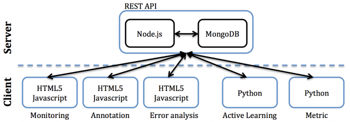

This paper presents the design of the collaborative annotation framework which has been implemented in the CAMOMILE project. The project aims at developing a collaborative annotation framework on 3M data, in which the manual annotation will be done remotely on many sites, while the final annotation will be localized on the main site. To this end, we have developed a prototype based on RESTful web services, following a client/server architecture. The proposed framework consists of two main parts: client and server. The server provides two REST-API services, one using node.js for resource manipulation and another using python for algorithmic processing. All exchanges of 3M data between client and server rely on JSON formats. The client part is based on javascript and HTML5 techniques.

Introduction
Human activity is constantly generating large volumes of heterogeneous data, in particular via the Web. These data can be collected and explored to gain new insights in social sciences, linguistics, economics, behavioural studies as well as artificial intelligence and computer sciences. In this regard, 3M (multimodal, multimedia, multilingual) data could be seen as a paradigm of sharing an object of study, human data, between many scientific domains. But, to be really useful, these data should be annotated, and available in very large amounts. Annotated data is useful for computer sciences which process human data with statistical-based machine learning methods, but also for social sciences which are more and more using the large corpora available to support new insights, in a way which was not imaginable few years ago. However, annotating data is costly as it involves a large amount of manual work, and in this regard 3M data, for which we need to annotate different modalities with different levels of abstraction is especially costly. Current annotation framework involves some local manual annotation, with the help of some automatic tools. The CAMOMILE CHIST-ERA project aims at developing a prototype of collaborative annotation framework on 3M data, in which the manual annotation will be done remotely on many sites, while the final annotation will be localized on the main site. Furthermore, with the same principle, some systems devoted to automatic processing of the modalities (speech, vision) present in the multimedia data will help the transcription, by producing automatic annotations. These automatic annotations are done remotely in each expertise point, which will be then combined locally to produce a meaningful help to the annotators. In order to develop this annotation concept, we focus on a practical case study: the problem of person annotation (who is speaking?, who is seen?) in video, which needs collaboration of high level automatic systems dealing with different media (video, speech, audio tracks, optical character recognition. . . ). The quality of the annotated data will be evaluated through the task of person retrieval, on different corpora. This case study will be broken down in multiple use cases. A use case will implement a simple scenario about one aspect of the collaborative annotation. Different corpora will be used for different use cases, but the REPERE corpus has a crucial role to benchmark most of them.
Collaborative Annotation Framework
Aiming for a flexible development and use, the collaborative annotation framework is implemented using state of the art web-based technologies, namely libraries and tools developed mostly in Javascript and Python. The ultimate purpose of the platform is to provide on demand overviews and details regarding the 3M data, and the associated automatic and manual annotations. Some views would be dedicated to the fine-grain inspection of annotation files, while some others would serve some higher-level task, such as summarizing the media of a specific corpus according to the exhaustiveness of their associated annotations, or the performance of the algorithms to infer the latter. Multiple users may be involved, synchronously or asynchronously, and with several roles (manual annotators, recognition algorithm developer, adjudicator). Web-based technologies and Javascript already comprise many building blocks suitable for supporting this kind of collaborative behavior. As illustrated in Figure 1, the proposed collaborative annotation framework follows a client/server architecture. This paradigm facilitates the work of multiple users on consistent data sources, as required by the project specifics. The involved server-side technologies rely solely on exchanges via the HTTP protocol, facilitating the design of interoperable software components. The server, described to a greater extent in the next section, focuses essentially on data and authentication management tasks, leaving the application logic to the client side. The aim of doing so is to design a general and consistent service, allowing the agile development of browser-based clients, each implemented according to a concrete use-case (e.g., annotation, error analysis, … ).

REST-API Server
There are two main reasons that made us implement client/server interfaces using REST services. First, in the REST architecture style, clients and servers exchange representations of resources using a standardized interface and protocol. These principles encourage RESTful applications to be simple, lightweight, and have high performance. Second, RESTful web services typically map the four main HTTP methods to perform predefined operations: GET, PUT, DELETE, and POST. These operations can fulfill the needs of annotating 3M data, such as create, read, update or delete annotations.
Resources are the fundamental concept in any RESTful API, and thus they need to be specified (as collections, tables, relationships between them) before designing REST API services. In our framework, resources are annotations, which are represented in JSON formats, stored in mongodb. Based on the use cases designed in the Camomile project, we specify the following collections (i.e. tables in traditional database systems) for our application: corpus, media, layers, annotations. The corpus collection describes all available corpora. Each corpus contains a set of media and a set of layer. A medium corresponds to a multimedia resource (e.g. a video or audio file). A layer is composed of multiple annotations with the same type (e.g. one layer for manual annotations of speech turns or one layer for annotations of face tracks). An annotation is uniquely defined by a media fragment (e.g. a temporal segment) and attached data (e.g. the name of the current speaker).

Figure 2 illustrates an ER diagram of these collections (tables), where: _id is the identifier of a resource; id_xxx is the identifier of the resource xxx; layer_type indicates the type of the layer, for example “speaker ground truth”. fragment_type is a generic type and describes the type of the fragments, which are annotation units stored in the annotation collection. Fragment_type can currently be segments or rectangles (for face recognition). data_type is the data type of each annotated fragment, and it can be a name of a speaker or a spoken person. The range of supported types is designed to be easily extended to potentially new annotation tasks. Source stores all information about the layer, including created_date, the path to its location on the server, etc. ACL correspond to the user or group rights on the resource (the media inherits the rights of the corpus to which it belongs, the annotations inherits the rights of the layers to which it belongs). Finally, history is a list of modifiers. To allow the 3M data stored in the above collections to be manipulated, each resource needs to have its own unique URL, used for method (i.e. operation) parametrization.

A documentation with all the routes available on this server can be found at 
[http://camomile-project.github.io/camomile-server](http://camomile-project.github.io/camomile-server)

The source code of the camomile server can be found at
[https://github.com/camomile-project/camomile-server](https://github.com/camomile-project/camomile-server)

